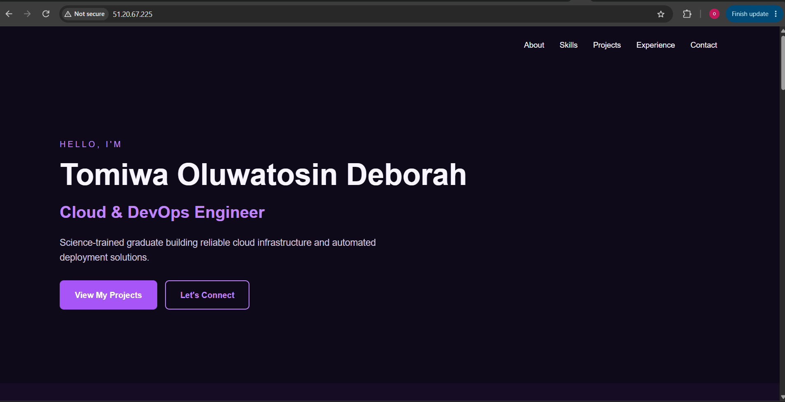
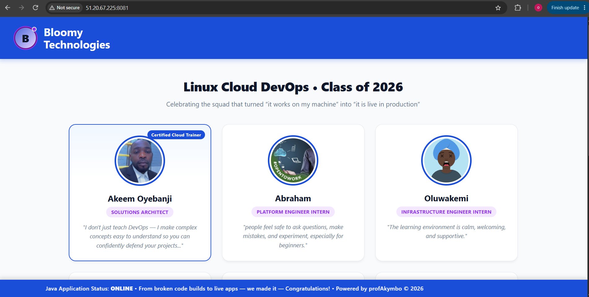
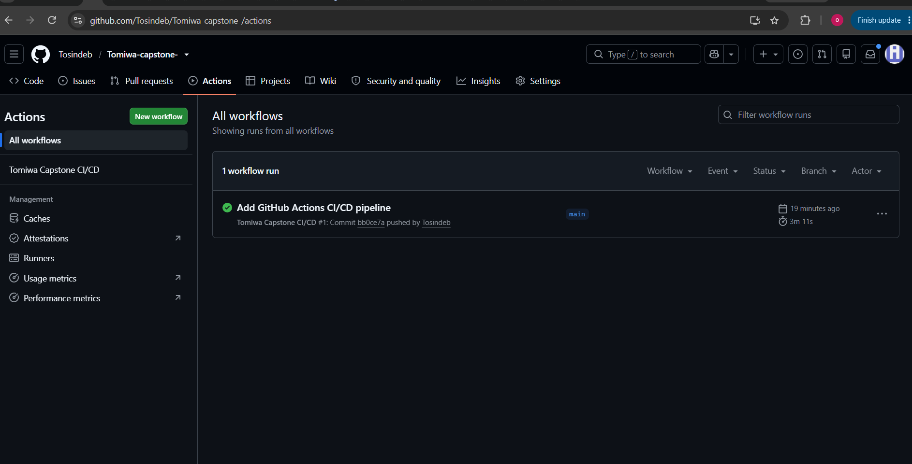
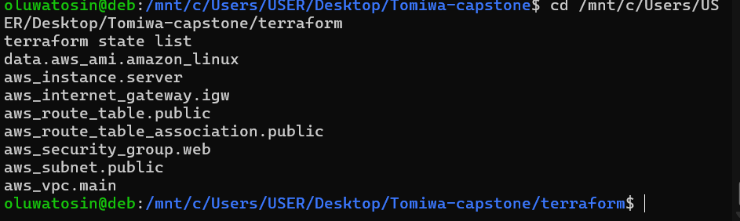
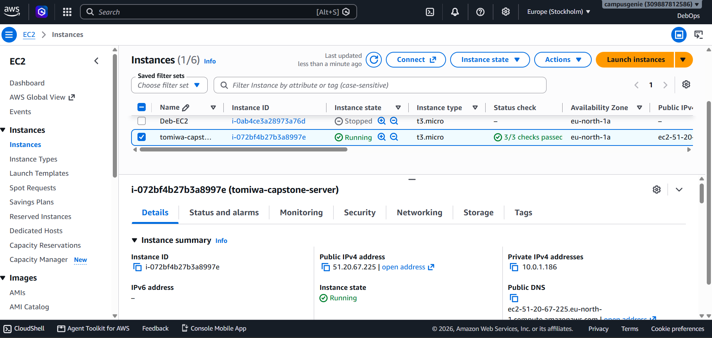
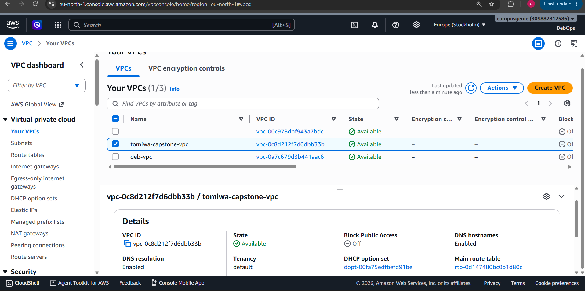
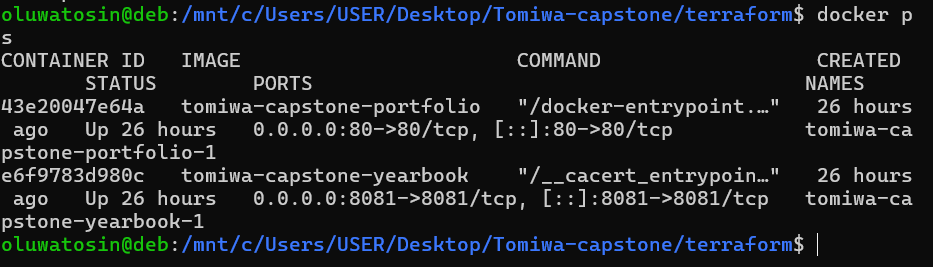
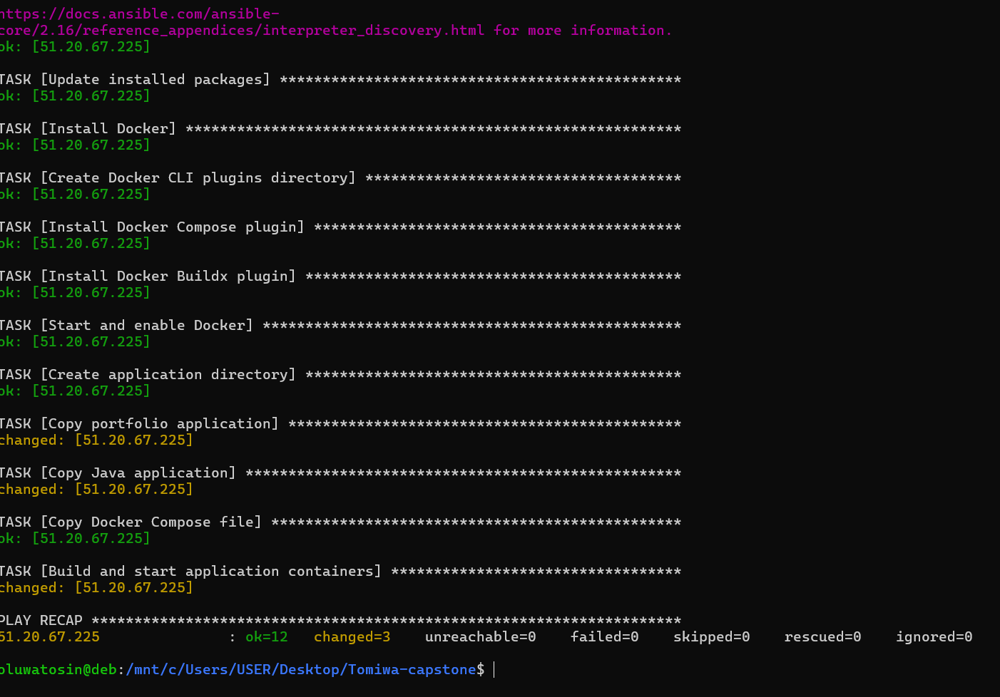

# Modern End-to-End DevOps Pipeline

A complete DevOps capstone project that provisions AWS infrastructure and automatically deploys two containerized applications to a single EC2 instance using Terraform, Ansible, Docker Compose, and GitHub Actions.

The project demonstrates an end-to-end workflow from source code to a publicly accessible deployment.

---

## Project Overview

The goal of this project was to design and implement an automated DevOps pipeline using modern Infrastructure as Code, configuration management, containerization, and CI/CD practices.

Two applications are deployed on the same AWS EC2 instance:

- A personal portfolio website served with Nginx on port `80`
- A Java Yearbook application running on port `8081`

Instead of manually configuring the cloud server and deploying the applications, the process is automated using Terraform, Ansible, Docker Compose, and GitHub Actions.

---

## Architecture

```text
Developer
   |
   | git push
   v
GitHub Repository
   |
   v
GitHub Actions
   |
   +---- Maven
   |       |
   |       +---- Builds Java JAR
   |
   +---- Terraform
   |       |
   |       +---- AWS VPC
   |       +---- Public Subnet
   |       +---- Internet Gateway
   |       +---- Route Table
   |       +---- Security Group
   |       +---- EC2 Instance
   |
   +---- Terraform Output
   |       |
   |       +---- EC2 Public IP
   |
   +---- Ansible
           |
           +---- Configure EC2
           +---- Install Docker
           +---- Install Docker Compose
           +---- Install Docker Buildx
           +---- Transfer application files
           |
           v
       Docker Compose
           |
           +---- Portfolio Container :80
           |
           +---- Java Yearbook Container :8081
```

---

## Technology Stack

| Technology | Purpose |
|---|---|
| Git & GitHub | Version control and source-code hosting |
| GitHub Actions | CI/CD automation |
| AWS | Cloud infrastructure provider |
| Terraform | Infrastructure as Code |
| Ansible | Server configuration and application deployment |
| Docker | Application containerization |
| Docker Compose | Multi-container management |
| Maven | Java application build |
| Java 17 | Java application runtime |
| Nginx | Portfolio web server |
| Linux | Development and server environment |

---

## Project Structure

```text
Tomiwa-capstone/
├── .github/
│   └── workflows/
│       └── deploy.yml
│
├── ansible/
│   ├── inventory.ini
│   └── playbook.yml
│
├── java-app/
│   ├── src/
│   ├── pom.xml
│   └── Dockerfile
│
├── portfolio/
│   ├── index.html
│   └── Dockerfile
│
├── terraform/
│   ├── main.tf
│   ├── outputs.tf
│   └── provider.tf
│
├── screenshots/
├── docker-compose.yml
├── .gitignore
└── README.md
```

> `inventory.ini`, Terraform state files, build artifacts, private keys, and other sensitive/local files are excluded from version control where appropriate.

---

## Application Containerization

### Portfolio

The portfolio is a static web application served using an Nginx container.

The container exposes port `80`.

### Java Yearbook Application

The Java application is built using Maven and Java 17.

Maven packages the application into a JAR file, which is then copied into the application's Docker image.

The application listens on port `8081`.

### Docker Compose

Docker Compose manages both applications on the same EC2 instance.

The services are exposed as:

```text
Portfolio       → Host Port 80
Java Yearbook   → Host Port 8081
```

This allows both applications to run independently while sharing one cloud server.

---

## AWS Infrastructure with Terraform

Terraform is used to provision and manage the AWS infrastructure in the `eu-north-1` region.

The infrastructure includes:

- Custom VPC
- Internet Gateway
- Public Subnet
- Route Table
- Route Table Association
- Security Group
- EC2 Instance

The security group permits the required application and administration traffic:

```text
22    → SSH
80    → Portfolio
8081  → Java Yearbook
```

### Remote Terraform State

Terraform state is stored remotely in an Amazon S3 bucket rather than relying only on local state.

The backend uses:

```text
tomiwa-capstone-terraform-state-2026
```

Remote state allows temporary GitHub Actions runners to access the same Terraform state and manage the existing infrastructure consistently.

S3 lockfile-based state locking is also configured to help prevent conflicting Terraform operations.

### EC2 Public IP Output

Terraform exposes the EC2 public IP through an output variable.

The CI/CD workflow retrieves it using:

```bash
terraform output -raw ec2_public_ip
```

This allows the pipeline to dynamically tell Ansible which EC2 instance to configure.

---

## Configuration Management with Ansible

Ansible automates the configuration of the EC2 instance.

The playbook performs tasks including:

- Updating installed packages
- Installing Docker
- Installing the Docker Compose plugin
- Installing Docker Buildx
- Starting and enabling Docker
- Creating the application directory
- Copying the portfolio application
- Copying the Java application
- Copying the Docker Compose configuration
- Building and starting both containers

The applications are deployed using:

```bash
docker compose up -d --build
```

This removes the need to manually SSH into the server and perform each configuration and deployment step individually.

---

## CI/CD Pipeline with GitHub Actions

The CI/CD pipeline is defined in:

```text
.github/workflows/deploy.yml
```

A push to the `main` branch automatically triggers the workflow.

The pipeline performs the following process:

```text
Push to main
     |
     v
Checkout Repository
     |
     v
Set Up Java 17
     |
     v
Build Java Application with Maven
     |
     v
Set Up Terraform
     |
     v
Authenticate to AWS
     |
     v
Terraform Init
     |
     v
Terraform Apply
     |
     v
Retrieve EC2 Public IP
     |
     v
Install Ansible
     |
     v
Generate Ansible Inventory
     |
     v
Connect to EC2
     |
     v
Run Ansible Playbook
     |
     v
Docker Compose Builds and Deploys Applications
```

The Ansible inventory is generated dynamically during the workflow using the public IP returned by Terraform.

This means the EC2 IP address does not need to be hardcoded into the CI/CD workflow.

---

## Security Practices

Sensitive information is not hardcoded into the repository.

GitHub Actions secrets are used for:

- AWS Access Key ID
- AWS Secret Access Key
- EC2 SSH Private Key

The repository's `.gitignore` also prevents sensitive and generated files from being committed, including:

```text
Terraform state files
Terraform variable files
Ansible local inventory
SSH private keys
Java/Maven build output
```

For a production environment, GitHub OIDC with short-lived AWS credentials would be preferable to long-lived AWS access keys.

---

## Deployment Evidence

### Live Portfolio



### Live Java Yearbook Application



### Successful GitHub Actions Pipeline



### Terraform Managed Infrastructure



### AWS EC2 Instance



### AWS VPC



### Docker Containers Running on EC2



### Successful Ansible Deployment



---

## Troubleshooting and Challenges

Several issues were encountered and resolved during the implementation of the project.

### Changing Amazon Linux AMI

The Terraform configuration initially selected the most recent Amazon Linux 2023 AMI dynamically.

When AWS released a newer image, Terraform detected the new AMI and proposed replacing the existing EC2 instance.

The Terraform plan was inspected before applying the change, and the AMI was pinned to the known working image to prevent an unnecessary EC2 replacement.

This demonstrated the importance of reviewing Terraform plans before applying infrastructure changes.

### Docker Compose on Amazon Linux 2023

The expected Docker Compose package was not directly available through the package installation method being used on Amazon Linux 2023.

The Docker Compose CLI plugin was therefore installed explicitly through Ansible.

### Docker Buildx

The first automated container build on EC2 failed because Docker Compose required a compatible version of Docker Buildx.

The error was diagnosed and the Ansible playbook was updated to install Docker Buildx automatically.

This ensured future server configuration and deployments included the required dependency instead of relying on a manual server fix.

### Local Port 80 Conflict

During local Docker Compose testing, port `80` was already being used by Apache.

The conflicting service was identified and stopped before the Compose environment was recreated successfully.

---

## Key Lessons

This project provided practical experience with the complete lifecycle of a cloud deployment.

Key lessons included:

- Provisioning cloud infrastructure using Infrastructure as Code
- Understanding AWS networking components and how they work together
- Managing Terraform state remotely
- Reading Terraform plans before applying changes
- Building Java applications with Maven
- Containerizing different application types
- Managing multiple containers with Docker Compose
- Automating Linux server configuration with Ansible
- Using GitHub Secrets for sensitive CI/CD values
- Passing information between Terraform and Ansible
- Building an automated CI/CD workflow with GitHub Actions
- Troubleshooting deployment failures using logs instead of applying random fixes

---

## Deployment Result

The final solution successfully deploys two applications to a single AWS EC2 instance.

```text
Portfolio       → Port 80
Java Yearbook   → Port 8081
```

A push to the `main` branch triggers the automated pipeline, which builds the Java application, manages the AWS infrastructure with Terraform, retrieves the EC2 public IP, configures the server with Ansible, and deploys both applications using Docker Compose.

The complete workflow was tested successfully with both applications publicly accessible after an automated GitHub Actions deployment.

---

## Future Improvements

Possible improvements include:

- Use GitHub OIDC for short-lived AWS authentication
- Add HTTPS and a custom domain
- Place applications behind a reverse proxy
- Restrict SSH access instead of allowing it from all IP addresses
- Add automated application tests before deployment
- Add Terraform validation and planning stages to CI
- Add monitoring and centralized logging
- Implement separate development and production environments
- Store container images in a container registry such as Amazon ECR

---

## Author

**Tomiwa Oluwatosin Deborah**

Cloud & DevOps Engineering

GitHub: `Tosindeb`

